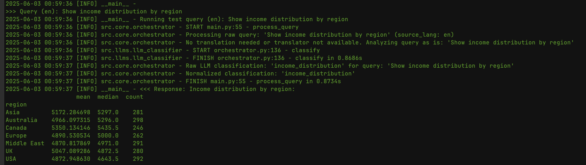
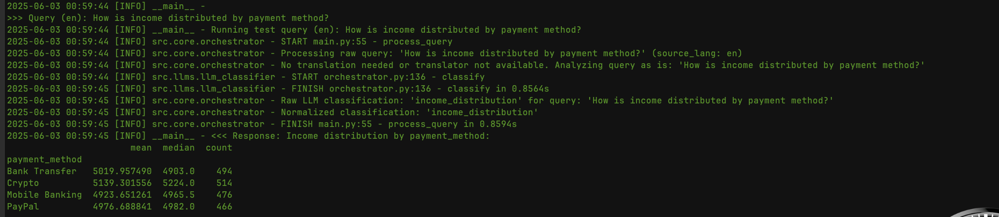
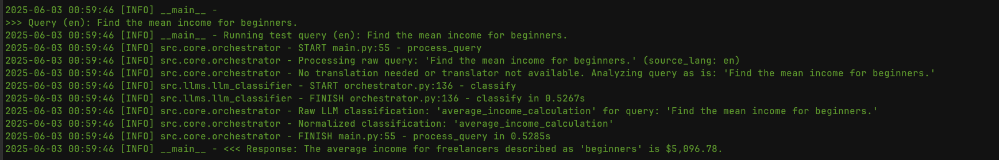
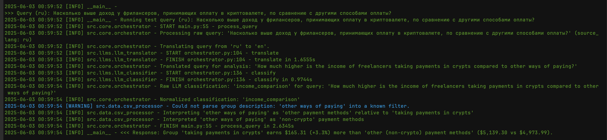
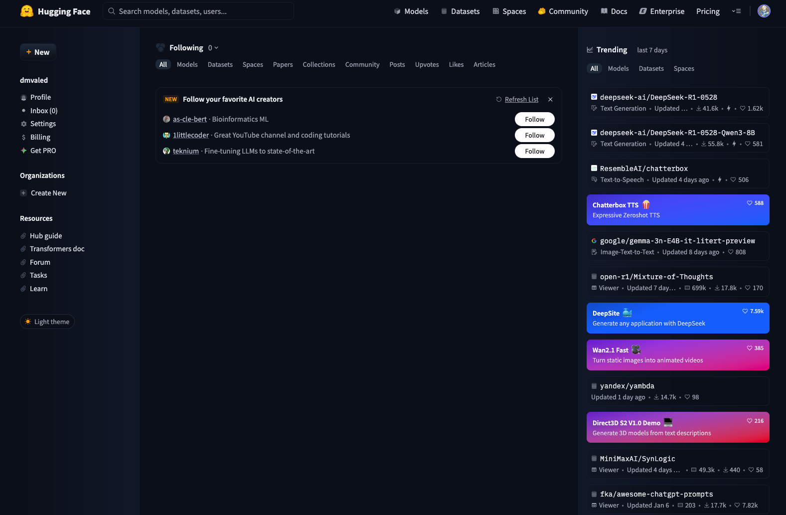
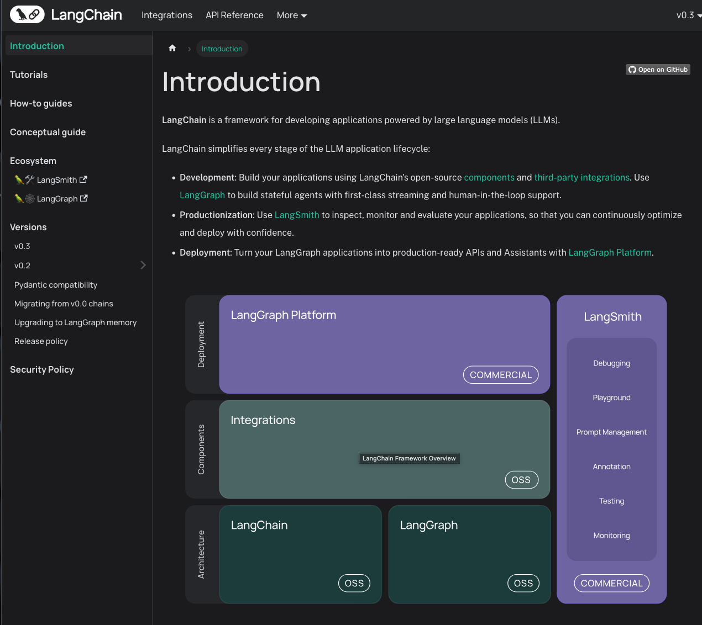

# LLM Freelancer Analytics CLI
<!-- Badge Definitions -->
[python-badge]: https://img.shields.io/badge/python-3.12%2B-blue
[python-link]: https://www.python.org/
[pandas-badge]: https://img.shields.io/badge/pandas-2.2.3%2B-blue
[pandas-link]: https://pandas.pydata.org/
[transformers-badge]: https://img.shields.io/badge/transformers-4.52.4%2B-blue
[transformers-link]: https://huggingface.co/docs/transformers/index
[pytorch-badge]: https://img.shields.io/badge/PyTorch-2.2.2%2B-blue
[pytorch-link]: https://pytorch.org/
[ruff-badge]: https://img.shields.io/endpoint?url=https://raw.githubusercontent.com/astral-sh/ruff/main/assets/badge/v2.json
[ruff-link]: https://github.com/astral-sh/ruff
[license-badge]: https://img.shields.io/badge/License-MIT-yellow.svg
[license-link]: https://opensource.org/licenses/MIT

[![Python Version][python-badge]][python-link]
[![Pandas][pandas-badge]][pandas-link]
[![Transformers][transformers-badge]][transformers-link]
[![PyTorch][pytorch-badge]][pytorch-link]
[![Ruff][ruff-badge]][ruff-link]
[![License: MIT][license-badge]][license-link]

A command-line interface (CLI) tool for analyzing freelancer earnings data using natural language queries.
Our approach integrates a hybrid system: Natural Language Processing (NLP) for query understanding
and rule-based data processing for analysis. User queries are first interpreted by Language Models (LLMs)
for intent classification and multilingual translation. Subsequently, specific parameters are extracted
from the query using regex. These parameters drive precise analytical operations on the structured
dataset (CSV) via Pandas, ensuring both flexibility in input and accuracy in results without directly
exposing the dataset to the LLMs.


Run from Project Root: You should run this main.py using the module execution flag from your project's root directory (EORA):
```
python -m src.main --test
python -m src.main "your query here" --lang en
python -m src.main # For interactive mode
```

## Features

- **Natural Language Queries:** Ask questions about freelancer data in plain English or Russian.
- **Multilingual Support:** Input queries in Russian (translated to English for analysis).
- **Core Analytical Capabilities:**
  - **Income Comparison:** Compare average incomes between different freelancer groups (e.g., based on payment method, expertise).
  - **Income Distribution:** Show income statistics (mean, median, count) grouped by categories like region or payment method.
  - **Percentage Calculations:** Calculate percentages of freelancers meeting specific criteria (e.g., "percentage of experts with less than 10 projects").
  - **Average Income:** Determine the average income for a specific group of freelancers.
- **Modular Design:** Built with a clear separation of concerns for data processing, LLM interaction, query parsing, and orchestration.
- **Interactive Mode:** Engage in a conversation-like session to ask multiple queries.
- **Single Query Mode:** Get a quick answer to a single query passed as a command-line argument.
- **Test Mode:** Run a predefined suite of test queries to verify functionality.

## Technologies Used

- **Python:** Core programming language.
- **Pandas:** For efficient data manipulation and analysis of the CSV dataset.
- **Hugging Face `transformers`:** To leverage pre-trained language models for:
  - **Query Classification:** Using models like `google/flan-t5-small` to understand the intent of the user's query.
  - **Translation:** Using models like `Helsinki-NLP/opus-mt-ru-en` to translate Russian queries to English.
- **PyTorch:** As the backend deep learning framework for the Hugging Face models.
- **`safetensors`:** For secure and efficient model weight loading.
- **`sentencepiece`:** Tokenization library required by some translation models.
- **`argparse`:** For parsing command-line arguments.
- **`pathlib`:** For robust path manipulations.
- **`logging`:** For application logging.

## Project Summary

*   **Modular Application Structure:**
    *   `CsvDataProcessor`: Handles all data loading, cleaning, and direct analytical operations.
    *   `LLMClassifier`: Manages query classification using a language model.
    *   `LLMTranslator`: Provides translation capabilities for multilingual input.
    *   `QueryParser`: Extracts specific parameters from classified queries using regex.
    *   `FreelancerQueryOrchestrator`: Coordinates the overall query processing workflow.

*   **Core Analytical Capabilities:**
    The system can proficiently handle a variety of analytical queries:
    *   **Income Comparison:** Compares average incomes between different freelancer groups, including contextual handling for "X vs. Other" scenarios (e.g., "crypto vs. non-crypto").
    *   **Income Distribution:** Shows income statistics (mean, median, count) grouped by specified categories.
    *   **Percentage Calculations:** Calculates percentages of freelancers meeting defined conditions and criteria, with improved parsing for query variations.
    *   **Average Income Calculation:** Determines the average income for specified single groups of freelancers.
    *   **Mode Calculation:** Identifies the most common (modal) value within a given category (e.g., "most common job category").

*   **Multilingual Input:**
    Supports queries in Russian, which are automatically translated into English before analysis, broadening the tool's accessibility.

*   **Enhanced Robustness:**
    Development has addressed and resolved several complex technical challenges, including:
    *   Nuances in LLM interaction and prompt engineering for accurate query understanding.
    *   Secure and efficient model loading using `safetensors`.
    *   Management of critical dependencies like `sentencepiece`.
    *   Refined regular expression parsing for diverse query phrasings.

*   **Comprehensive Logging:**
    Informative logging is integrated throughout the application, providing clear insights into the execution flow and aiding in debugging or monitoring.

*   **Functional CLI Interface:**
    Offers a user-friendly command-line interface with multiple modes of operation:
    *   Interactive session for sequential queries.
    *   Single-query execution via command-line arguments.
    *   A test mode to run a predefined suite of queries for validation.


[]()

[]()

[]()

[]()

[]()

[]()
